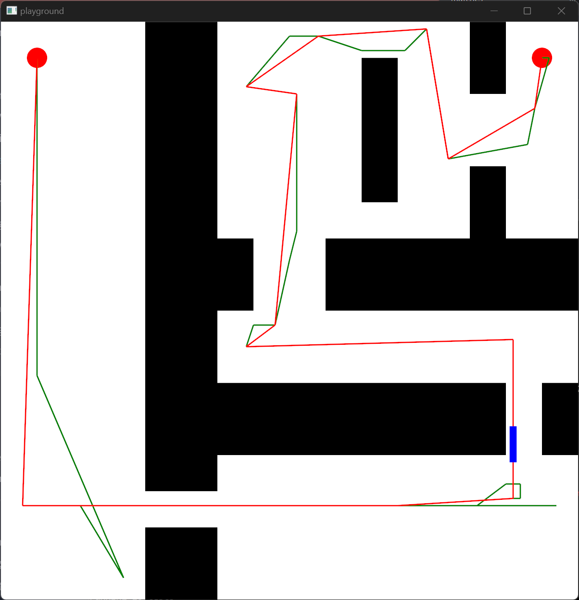

# robo-path-planner
A toy 2D robot plan planning demo written in Rust.

## Background
This repo was inspired by the desire to kill two birds with one stone:

*   I was recently made aware that thanks to corporate moonlighting policies, almost every single
    line of code that I have written since college contractually belongs to my employers. As a
    result, there is no public evidence that I actually know how to code.
*   One of my 2023 New Year Resolutions is to learn how to program in Rust.

## Description
This is a 2d simulation of [robot motion planning](https://en.wikipedia.org/wiki/Motion_planning).
It is a modernized version of an old student project.

The simulation contains:

*   A rectangular field (in white)
*   A set of obstacles (in black)
*   A robot (in blue)
*   Start and end points (in red)

After starting, the simulation will attempt to find a path from start to end using the
[Rapid Random Tree](https://en.wikipedia.org/wiki/Rapidly-exploring_random_tree) algorithm.

*   The raw computed path is in green.
*   A compacted path is in red.

The robot then attempts to follow the compacted path.

## Instructions
1. Make sure that you have [Rust](https://www.rust-lang.org/) and [Cargo](https://doc.rust-lang.org/cargo/) installed.
2. Git clone the repo
3. Execute `cargo run`.